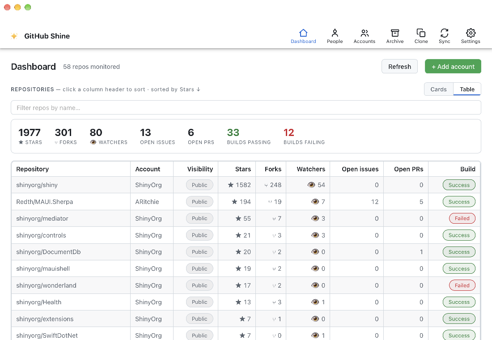

<p align="center">
  
</p>

<h1 align="center">GitHub Shine</h1>

<p align="center"><em>Shine a spotlight on your github repos - powered by Shiny.NET</em></p>

A cross-platform desktop dashboard for keeping an eye on the GitHub repositories you care about. GitHub Shine is a **.NET MAUI Blazor Hybrid** app that polls GitHub through fine-grained personal access tokens and surfaces stars, forks, issues, pull requests, and CI build status at a glance — with native notifications when something needs your attention, a tray menu for quick access, and bulk source archiving.



## Features

GitHub Shine is organized into four tabs — **Dashboard**, **Accounts**, **Archive**, and **Settings**.

- **At-a-glance repo dashboard** — every monitored repo is rendered as a card showing open issues, open pull requests, stars, forks, watchers, and the status of its latest workflow run.
- **Aggregate totals bar** — running sums across all repos for stars, forks, watchers, open issues, open PRs, and how many builds are currently passing vs. failing.
- **Sortable sidebar** — sort your repositories by most stars (default), forks, open issues, open PRs, or build status; clicking a repo scrolls it into focus in the main panel. The sort order is shared with the tray menu.
- **Live search** — filter the repo grid as you type with a case-insensitive "contains" match on repo name and account.
- **Drag-to-reorder** — arrange the dashboard cards by drag-and-drop (or the `‹ ›` buttons); your layout is persisted between sessions.
- **"Needs your attention" inbox** — pulls your GitHub notifications and highlights the ones that matter: mentions, assignments, and requested reviews.
- **Repository archive** — on the Archive tab, multi-select repos and download a source zip of each one's default branch into a folder of your choice, with per-repo progress, a Saved/Failed badge, and cancellation.
- **Native notifications** — get notified about new issues, new pull requests, and failed workflow runs; mute them from the Settings tab or the tray menu.
- **Tray menu with repo list** — a monochrome template tray icon whose menu opens the dashboard, refreshes, toggles mute, and lists your repositories (in the same order as the sidebar) — click one to open it on GitHub.
- **Settings tab** — mute notifications, choose the repository sort order (shared by the sidebar and tray), set the refresh interval, and back up or restore the database.
- **Background polling** — the refresh interval is configurable from Settings, with an immediate refresh whenever you add, edit, or remove an account/repo.
- **Multiple GitHub accounts** — monitor repos across several accounts, each backed by its own fine-grained PAT.
- **Secure token storage** — access tokens are kept in a secure vault, never in plain configuration.
- **Database backup/restore** — export and import the local store (accounts, repos, tokens, card order) as a single SQLite file from the Settings tab.
- **Truly cross-platform desktop** — runs natively on **macOS** (AppKit), **Linux** (GTK4), and **Windows**, all from a single MAUI project.

## Third-Party Libraries

| Library | Purpose | Documentation |
| --- | --- | --- |
| [.NET MAUI (`Microsoft.Maui.Controls`)](https://learn.microsoft.com/dotnet/maui/) | Cross-platform application framework | <https://learn.microsoft.com/dotnet/maui/> |
| [Blazor Hybrid (`Microsoft.AspNetCore.Components.WebView.Maui`)](https://learn.microsoft.com/aspnet/core/blazor/hybrid/) | Hosts the Blazor UI inside the MAUI shell | <https://learn.microsoft.com/aspnet/core/blazor/hybrid/> |
| [`Microsoft.Extensions.Logging`](https://learn.microsoft.com/dotnet/core/extensions/logging) | Debug/console logging | <https://learn.microsoft.com/dotnet/core/extensions/logging> |
| [Octokit](https://github.com/octokit/octokit.net) | Official GitHub API client for .NET | <https://github.com/octokit/octokit.net> |
| [Shiny.Mediator](https://shinylib.net/mediator/) | In-process mediator for commands, requests, and events | <https://shinylib.net/mediator/> |
| [Shiny.Notifications](https://shinylib.net/client/notifications/) | Cross-platform local notifications | <https://shinylib.net/client/notifications/> |
| [Shiny.Blazor.Controls / Shiny.Maui.Controls.Desktop](https://github.com/shinyorg/maui-controls) | UI control library (pills, toasts, desktop helpers) | <https://github.com/shinyorg/maui-controls> |
| [Shiny.DocumentDb.Sqlite](https://www.nuget.org/packages/Shiny.DocumentDb.Sqlite) | Local document store backed by SQLite | <https://www.nuget.org/packages/Shiny.DocumentDb.Sqlite> |
| [Shiny.Extensions.Stores](https://www.nuget.org/packages/Shiny.Extensions.Stores) | Key/value settings stores | <https://www.nuget.org/packages/Shiny.Extensions.Stores> |
| [Shiny.Extensions.DependencyInjection](https://www.nuget.org/packages/Shiny.Extensions.DependencyInjection) | Source-generated DI registration | <https://www.nuget.org/packages/Shiny.Extensions.DependencyInjection> |
| [Platform.Maui.MacOS (maui-labs)](https://www.nuget.org/packages/Platform.Maui.MacOS) | Native macOS (AppKit) MAUI backend + BlazorWebView | <https://www.nuget.org/packages/Platform.Maui.MacOS> |
| [Platform.Maui.Linux.Gtk4 (maui-labs)](https://www.nuget.org/packages/Platform.Maui.Linux.Gtk4) | Native Linux (GTK4) MAUI backend + BlazorWebView | <https://www.nuget.org/packages/Platform.Maui.Linux.Gtk4> |

## Getting Started

### Prerequisites

- [.NET 10 SDK](https://dotnet.microsoft.com/download)
- The `maui` workload: `dotnet workload install maui`
- A GitHub [fine-grained personal access token](https://github.com/settings/tokens?type=beta) with read access to the repositories you want to monitor.

### Build & Run

```bash
# from the repository root
dotnet build GitHubShine.slnx

# run on the current desktop platform (macOS / Linux / Windows)
dotnet build src/GitHubShine/GitHubShine.csproj -t:Run
```

On first launch, add a GitHub account with its fine-grained PAT, pick the repositories to monitor, and the dashboard will begin polling.

## Project Layout

```
GitHubShine.slnx                  Solution
src/GitHubShine/
├─ Components/                  Blazor pages, layout, and routes
├─ Features/
│  ├─ Accounts/                 Account/repo config, secure token vault
│  ├─ Archive/                  Bulk source-zip download of selected repos
│  ├─ Dashboard/                Snapshots, polling, Mediator handlers
│  ├─ Settings/                 App settings, file dialogs, database backup/restore
│  └─ Tray/                     System tray icon + repo menu
├─ Platforms/                   macOS / Linux / Windows entry points
└─ wwwroot/                     Blazor host page and CSS
```
