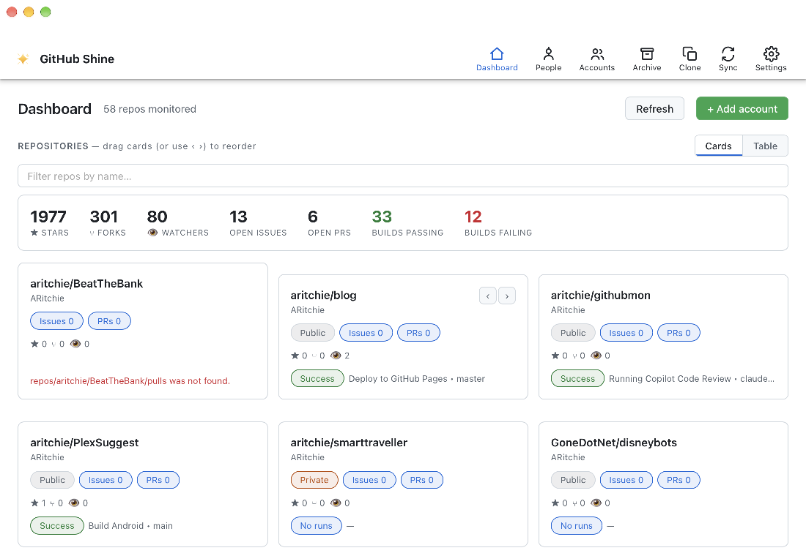
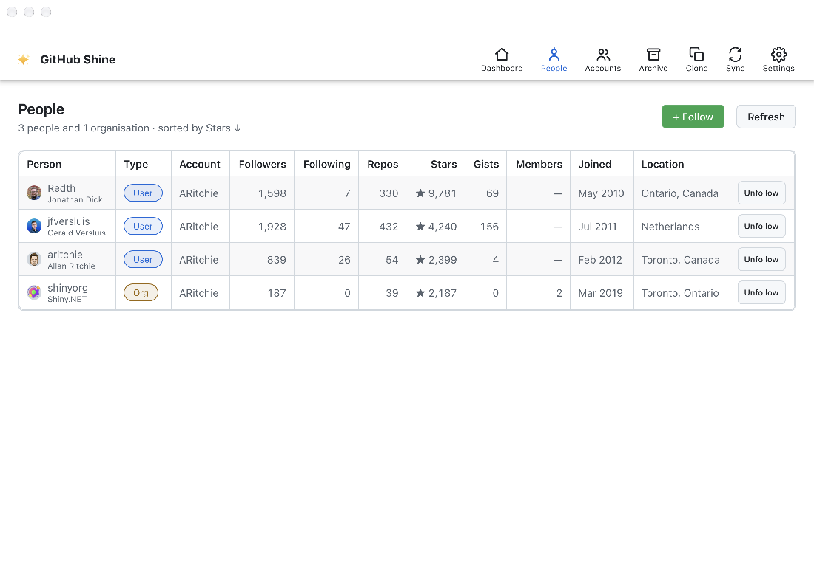
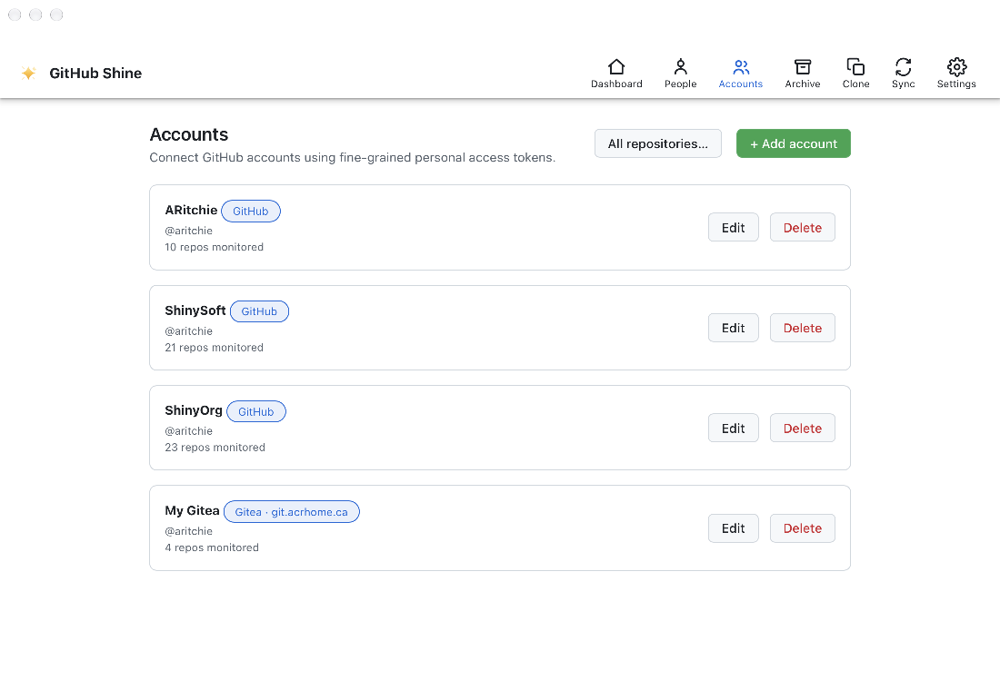
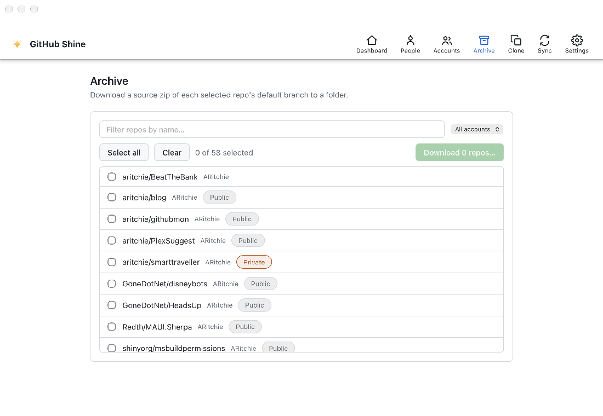
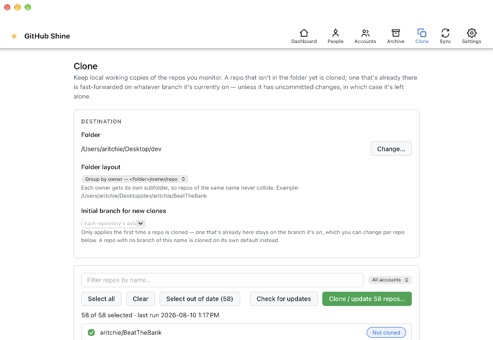
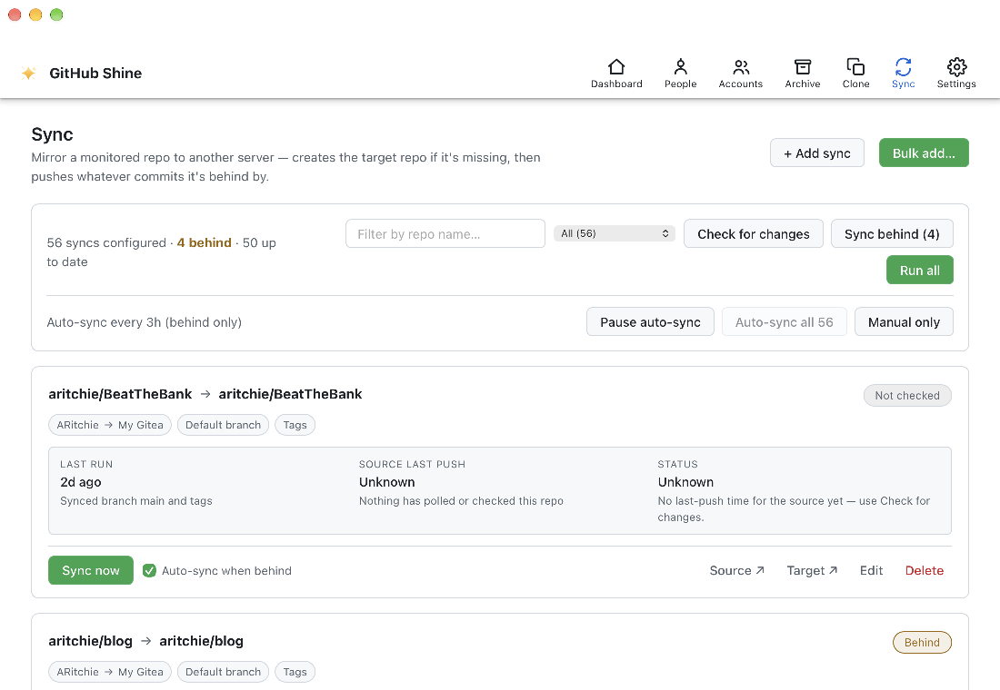
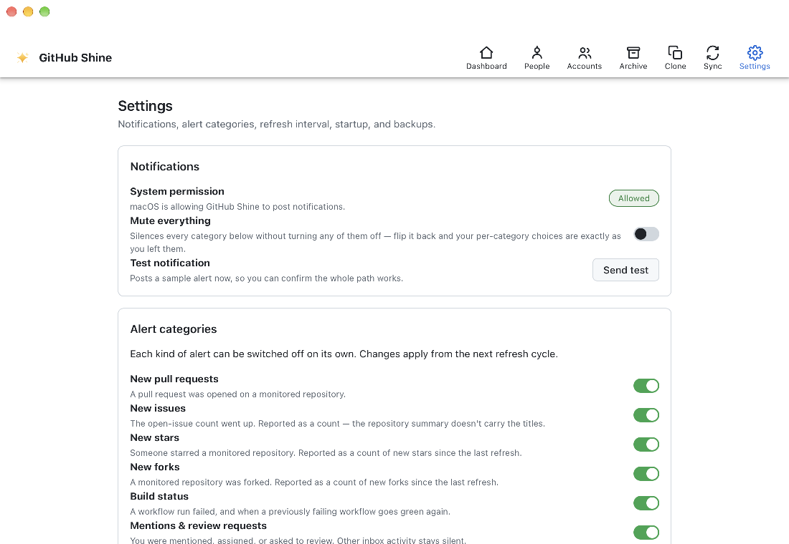

<p align="center">
  
</p>

<h1 align="center">GitHub Shine</h1>

<p align="center"><em>Shine a spotlight on your github repos - powered by Shiny.NET</em></p>

GitHub Shine is a cross-platform dashboard for the repositories you care about. It is a **.NET MAUI Blazor Hybrid** app that runs on macOS, Windows, Linux, iOS and Android. It polls **GitHub**, **GitHub Enterprise** and **Gitea / Forgejo** using personal access tokens, and shows stars, forks, watchers, issues, pull requests and CI build status at a glance. It also sends native notifications when something changes, and lives in the system tray.

Beyond monitoring, it can follow people and organisations, download source archives in bulk, keep local git clones up to date, and mirror repositories from one server to another.


## Features

The app has seven tabs: **Dashboard**, **People**, **Accounts**, **Archive**, **Clone**, **Sync** and **Settings**. On mobile they become a bottom tab bar. Archive and Sync are desktop-only.

### Dashboard
- **Cards or Table view**. Switch between a card grid and a sortable table. The app remembers your choice.
- **Card view**
  - Each repo card shows its Public/Private visibility, open issues and PRs, stars, forks, watchers, and its latest workflow run with status and description.
  - Every item links straight to the matching page on the host.
  - Reorder cards by dragging them or with the `‹ ›` buttons. The order is saved.
- **Table view**. Sort by Repository, Account, Visibility, Stars, Forks, Watchers, Open issues, Open PRs or Build status. The sort is saved (default: most stars), and the tray menu uses the same order.
- **Totals bar**. Running totals across all monitored repos: stars, forks, watchers, open issues, open PRs, and how many builds are passing or failing.
- **Live filter**. Case-insensitive match on repo name or account, with an "X of Y" count.
- **"Needs your attention" inbox**. Surfaces the notifications that matter: mentions, assignments and requested reviews.
- **Instant start**. The dashboard is drawn from the local cache at launch, before any network call. If a refresh fails, the last good data stays on screen.

### People
- Follow users and organisations **locally**. Nothing is followed or changed on the server.
- The sortable grid shows avatar, name, type (User/Org), account, followers, following, public repos, total stars, gists, org members, join date and location.
- To add someone, pick an account (which also picks the host), look up a login, preview it, then follow.

### Accounts
- **Multiple accounts across providers**
  - GitHub (github.com)
  - GitHub Enterprise (custom host URL)
  - Gitea / Forgejo (self-hosted)
- Each account has its own personal access token.
- **Validate & list repos**. Checks the token, shows the login it belongs to, and opens a repo picker with filter, Select all and Clear. Repos the token can't see are flagged.
- **All repositories**. One screen across every account: filter by name or description, filter by account, or show only monitored repos. Bulk-select, then save.
- Deleting an account also removes its syncs and followed people.

### Archive (desktop)
- Multi-select repos, with name and account filters, and download a **source zip of each repo's default branch** to a folder of your choice.
- Each repo shows progress and a Saved/Failed result, and the whole run can be cancelled.

### Clone
- **Keeps real git working copies** of your monitored repos in a folder you pick. On mobile they go to the app's own storage.
- **Folder layout**: `owner/repo` (default) or flat `repo`.
- **Initial branch** for new clones: each repo's own default, or a branch name you choose.
- **Per repo**
  - Shows which branch is checked out and how many commits it is behind.
  - A branch picker checks out a different branch, including remote-only ones.
- **Buttons**
  - **Check for updates** fetches without changing anything on disk.
  - **Select out of date** picks only the repos that need an update.
- **Updates are safe**. Existing copies are only ever fast-forwarded. Uncommitted changes, a detached HEAD, a diverged branch, or an `origin` pointing somewhere else are reported and skipped.
- Git runs in-process via libgit2. No `git` install is required.

### Sync (desktop)
- **Mirror a repo to another server or account**, for example GitHub → your own Gitea.
  - If the target repo doesn't exist, it is created with the source's description and visibility.
  - Then whatever commits the target is behind on are pushed.
- **Options per sync**
  - Branches: default branch only, specific branches, or all branches.
  - Include tags.
  - Force-update refs. In all-branches mode this also removes branches the source no longer has.
- **Bulk add**. Point many repos at one destination account in a single step. Existing or conflicting configurations are flagged.
- **List view**
  - Search, plus a state filter: Behind, Never run, Up to date, Needs attention.
  - **Check for changes** compares each source's last push with the sync's last run.
  - Run everything with **Run all**, only the stale ones with **Sync behind**, or a single sync with **Sync now**. Each sync has its own run log.
- **Auto-sync** on a schedule of 3–48 hours. Per sync you choose whether it runs when behind or only manually. Auto-sync can be paused, and it sends a notification if any sync fails.
- Credentials go through a callback and are never written into a URL, command line or git config.

### Settings
- **Notifications**
  - OS permission status, with a button to request it.
  - **Mute everything**. Your per-category choices are kept for when you unmute.
  - **Send test**.
- **Alert categories**, each switchable on its own:
  - New pull requests
  - New issues
  - New stars
  - New forks
  - Build status (failed, and back to green)
  - Mentions & review requests
- **Refresh interval** (desktop): 15 seconds to 1 hour. Default is 2 minutes. Mobile refreshes in the background roughly every 3 hours.
- **Start with the computer** (desktop). Uses the Windows Run key, macOS login items (SMAppService) or the Linux `~/.config/autostart` folder.
- **Automatic sync** schedule, and whether each run syncs everything or only repos pushed since their last run.
- **Backup & Restore**. Exports everything to a single JSON file: accounts, tokens, followed people, syncs, preferences and seen-state. Restore merges it back in.

### Under the hood
- **Easy on rate limits**
  - Every request is a conditional GET with `If-None-Match`, so unchanged data returns a free `304`.
  - Polling backs off automatically when fewer than 100 API calls remain, and timing is jittered.
- **No duplicate alerts**. Seen builds, inbox items and each workflow's red/green state are stored, so restarting the app doesn't repeat notifications.
- **Background polling** via Shiny.Jobs: an in-process scheduler on desktop, BGTaskScheduler on iOS, WorkManager on Android. Changing an account or repo triggers an immediate refresh.
- **System tray / menu bar** (desktop)
  - A monochrome template icon. Left-click opens the dashboard.
  - The menu has Refresh now, Mute notifications, Quit, and a list of your repos with ✓/✗ build status in the dashboard's sort order. Click a repo to open it in your browser.
- **Tray-first desktop app**
  - On macOS, closing the window leaves the app in the menu bar and hides the Dock icon.
  - On Windows, closing or minimising hides the window to the tray.
  - A second launch on macOS (for example from a notification) hands off to the running copy instead of opening another instance.
- **Local storage**. Everything, including access tokens, lives in a local SQLite document database in the app's data folder.

## Screenshots

| | |
|---|---|
| **Dashboard — cards**<br> | **People**<br> |
| **Accounts**<br> | **Archive**<br> |
| **Clone**<br> | **Sync**<br> |
| **Settings**<br> | |

## Platforms

| Platform | Backend | Notes |
|---|---|---|
| macOS 15+ | AppKit (maui-labs `Microsoft.Maui.Platforms.MacOS`) | Menu-bar tray, single instance, universal binary |
| Windows 10 1809+ | WinUI | Close/minimise to tray |
| Linux x64 | GTK4 + WebKitGTK 6.0 (maui-labs `Microsoft.Maui.Platforms.Linux.Gtk4`) | No native file dialogs yet: archives and backups go to `~/Downloads` |
| iOS 15+ | UIKit | No tray, Archive, Sync or refresh-interval setting. Background refresh about every 3h |
| Android 7+ (API 24) | Android | Same as iOS |

## Third-Party Libraries

| Library | Purpose |
| --- | --- |
| [.NET MAUI](https://learn.microsoft.com/dotnet/maui/) (`Microsoft.Maui.Controls`) | Cross-platform application framework |
| [Blazor Hybrid](https://learn.microsoft.com/aspnet/core/blazor/hybrid/) (`Microsoft.AspNetCore.Components.WebView.Maui`) | Hosts the Blazor UI inside the MAUI shell |
| [maui-labs](https://www.nuget.org/packages/Microsoft.Maui.Platforms.MacOS) (`Microsoft.Maui.Platforms.MacOS` / `.Linux.Gtk4`, plus `.Essentials` and `.BlazorWebView`) | Native macOS (AppKit) and Linux (GTK4) MAUI backends |
| [Octokit](https://github.com/octokit/octokit.net) | GitHub API client (Gitea uses its REST API directly) |
| [LibGit2Sharp](https://github.com/libgit2/libgit2sharp) | In-process git for Clone and Sync |
| [Shiny.Mediator.Maui](https://shinylib.net/mediator/) | Mediator for requests, commands, events and persistent caching |
| [Shiny.Notifications](https://shinylib.net/client/notifications/) (+ `.Linux`) | Cross-platform local notifications |
| [Shiny.Jobs](https://shinylib.net/client/jobs/) | Background polling and auto-sync jobs |
| [Shiny.Hosting.Maui](https://shinylib.net/) / `Shiny.Core.Linux` | Shiny platform hosting |
| [Shiny.Blazor.Controls / Shiny.Maui.Controls.Desktop](https://github.com/shinyorg/maui-controls) | DataGrid, pills, toasts, toolbar and tray helpers |
| [Shiny.DocumentDb.Sqlite](https://www.nuget.org/packages/Shiny.DocumentDb.Sqlite) | Local document store backed by SQLite |
| [Shiny.Extensions.Stores](https://www.nuget.org/packages/Shiny.Extensions.Stores) | Key/value settings stores |
| [Shiny.Extensions.DependencyInjection](https://www.nuget.org/packages/Shiny.Extensions.DependencyInjection) | Source-generated DI registration |
| [Shiny.Extensions.MauiHosting](https://www.nuget.org/packages/Shiny.Extensions.MauiHosting) | Launch-at-login and app-support services |
| [Microsoft.Maui.DevFlow](https://github.com/dotnet/maui-labs) | UI inspection and automation (Debug builds only) |

## Install

Grab a build from the [latest release](https://github.com/aritchie/githubmon/releases/latest):

| Platform | Asset | Notes |
|---|---|---|
| macOS 15+ | `*-osx-universal.dmg` | Signed and notarized by Apple. Open the DMG and drag the app to Applications. Universal (Intel + Apple silicon). |
| Windows 10 1809+ | `*-win-x64.zip` | Unpack and run `GitHubShine.exe`. Self-contained, so no .NET install is needed. |
| Linux x64 | `*-linux-x64.tar.gz` | Unpack and run `./GitHubShine`. Requires GTK4 + WebKitGTK 6.0 on the host. |
| Android 7+ | `*-android.apk` | Sideload. The `.aab` is the Play Store upload bundle and can't be installed on a device. |
| iOS 15+ | `*-ios-unsigned.ipa` | Unsigned. You have to re-sign it with your own Apple account using a sideloading tool. |

Releases are cut by tagging; see [docs/RELEASING.md](docs/RELEASING.md).

## Getting Started

### Prerequisites

- [.NET 10 SDK](https://dotnet.microsoft.com/download)
- The `maui` workload: `dotnet workload install maui`
- A personal access token for each account you want to monitor, with read access to its repositories. This is a [fine-grained PAT](https://github.com/settings/tokens?type=beta) on GitHub, or an access token from your Gitea / Forgejo user settings. Sync also needs write access on the destination account.

### Build & Run

```bash
# from the repository root
dotnet build GitHubShine.slnx

# run on the current desktop platform (macOS / Linux / Windows)
dotnet build src/GitHubShine/GitHubShine.csproj -t:Run
```

On first launch, add an account and its token, choose **Validate & list repos**, pick the repositories to monitor, and the dashboard starts polling.

macOS and Linux build on the experimental maui-labs backends. See [CLAUDE.md](CLAUDE.md) for build and packaging gotchas, especially which macOS Release bundle to deploy.

## Project Layout

```
GitHubShine.slnx                  Solution
src/GitHubShine/
├─ Components/                  Blazor pages, layout, shared components
├─ Features/
│  ├─ Accounts/                 Accounts, monitored repos, token vault, dashboard prefs
│  ├─ Archive/                  Bulk source-zip download
│  ├─ Clone/                    Local working copies: status, branch switching, fast-forward
│  ├─ Dashboard/                Snapshots, polling job, Mediator handlers, snapshot cache
│  ├─ Git/                      libgit2 runtime loading
│  ├─ Jobs/                     Shiny.Jobs startup
│  ├─ Notifications/            Alert categories, prefs, notification tap handling
│  ├─ Persons/                  Followed people and organisations
│  ├─ Providers/                GitHub (Octokit) and Gitea providers, ETag handler, rate limiting
│  ├─ Settings/                 Backup/restore, file dialogs, launch at login
│  ├─ Sync/                     Repo mirroring engine, auto-sync job
│  └─ Tray/                     System tray icon + repo menu
├─ Platforms/                   macOS / Linux / Windows / iOS / Android entry points
└─ wwwroot/                     Blazor host page and CSS
eng/                            CI signing/notarization scripts, libgit2 natives, entitlements
```
